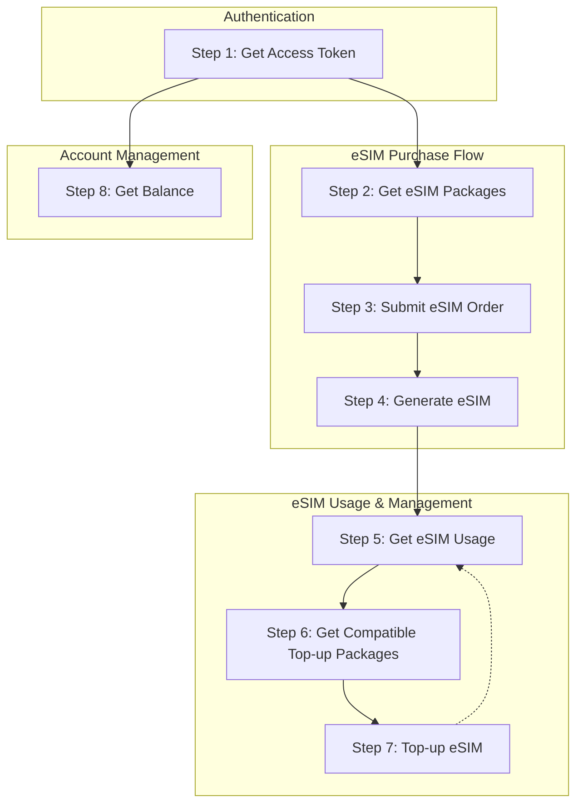

import { Tabs } from 'nextra/components';

# eSIM API Overview

## Table of Contents
- [eSIM Overview](#eSIM-Overview)
- [Recommended steps to use eSIM API](#recommended-steps-to-use-esim-api)

## Roamify eSIM Overview
Roamify eSIM API consists of the following services:

- [Countries](/esims/countries)
- [Packages](/esims/packages)
- [Orders](/esims/orders)
- [eSIMs](/esims/esims)
- [eSIM Events](/esims/events)
- [eSIMs Link](/esims/esims-link)
- [Compatible Devices](/esims/compatible-devices)
- [Balance](/esims/balance)

You can use these services to buy eSIMs, check your balance, and more.

## Recommended steps to use eSIM API

### Step 0: Flow Diagram


### Step 1: Authentication
You need to have your Access Token to make requests to Roamify eSIM API. You can get your Access Token from [Roamify Partner Portal](https://partner.getroamify.com/sign-in).

If you don't have an account, you can sign up [here](https://partner.getroamify.com/sign-up) or contact us at [support@getroamify.com](mailto:support@getroamify.com).

Our token is a Bearer token, which means you need to include it in the `Authorization` header of your requests.

### Step 2: Get eSIM Packages
To get a list of eSIM packages, you need to send a `GET` request to the `/api/esim/packages` endpoint. 

This endpoint will return a list of all available eSIM packages. You can also filter the packages by country, geography, days, gbs and isUnlimited parameters.

#### Usage - how to get eSIM packages
Here is an example of how you can get a list of eSIM packages using Roamify eSIM API.
<Tabs items={['curl', 'javascript']}>
    <Tabs.Tab index={0}>
        ```bash
        curl --request GET \
        --url 'https://api-dev.getroamify.com/api/esim/packages' \
        --header 'Authorization: Bearer Access Token' \
        --header 'Content-Type: application/json'
        ```
    </Tabs.Tab>
    <Tabs.Tab index={1}>
        ```javascript
        const axios = require('axios');

        axios.get('https://api-dev.getroamify.com/api/esim/packages', {
            headers: {
                'Authorization': 'Bearer {access token here}',
                'Content-Type': 'application/json'
            }
        })
        .then(response => {
            console.log(response.data);
        })
        .catch(error => {
            console.error(error);
        });
        ```
    </Tabs.Tab>
</Tabs>

You can read more about this endpoint [here](/esims/packages).

### Step 3: Submit an eSIM Order
To submit an eSIM order, you need to send a `POST` request to the `/api/esim/order` endpoint with the required body parameters.

The request body should contain the following parameters:
- `items`: An array of eSIMs you want to order. Each eSIM should contain the following details:
  - `packageId`: The ID of the eSIM package. This is a required field of type `string`.
  - `quantity`: The quantity of the eSIMs you want to order. This is a required field of type `number`.

OR

Alternatively, you can send a `POST` request to the `/api/esim/order` endpoint with the id your provided as 'referenceId' in the request body.

#### Usage - how to create an eSIM order
Here is an example of how you can create an eSIM order using Roamify eSIM API.
<Tabs items={['curl', 'javascript']}>
    <Tabs.Tab index={0}>
        ```bash
        curl --request POST \
        --url 'https://api-dev.getroamify.com/api/esim/order' \
        --header 'Authorization: Bearer Access Token' \
        --header 'Content-Type: application/json' \
        --data '{
            "items": [
                {
                    "packageId": "Package ID",
                    "quantity": 1
                }
            ]
        }'
        ```
    </Tabs.Tab>
    <Tabs.Tab index={1}>
        ```javascript
        const axios = require('axios');

        axios.post('https://api-dev.getroamify.com/api/esim/order', {
            items: [
                {
                    packageId: 'Package ID',
                    quantity: 1
                }
            ]
        }, {
            headers: {
                'Authorization': 'Bearer {access token here}',
                'Content-Type': 'application/json'
            }
        })
        .then(response => {
            console.log(response.data);
        })
        .catch(error => {
            console.error(error);
        });
        ```
    </Tabs.Tab>
</Tabs>

You can read more about this endpoint [here](/esims/orders).

### Step 4: Generate eSIM
As soon as you submit an eSIM order, in the response, you will get a dedicated `esimId` for each eSIM package you ordered. You can use this `esimId` to generate an eSIM, which will be ready to be used by your customers.

Alternatively, you can also use the `referenceId` you provided in the request body to generate an eSIM if applicable.

To generate an eSIM, you need to send a `POST` request to the `/api/esim/apply` endpoint with the required body parameters.

The request body should contain the following parameters:
- `esimId`: The ID of the eSIM. This is a required field of type `string`.
- `referenceId`: The reference ID you provided when creating the order. This is an optional field of type `string`. (Your custom reference ID for the order, if needed.))

#### Usage - how to generate an eSIM profile
Here is an example of how you can apply an eSIM profile using Roamify eSIM API.

<Tabs items={['curl', 'javascript']}>
    <Tabs.Tab index={0}>
        ```bash
        curl --request POST \
        --url 'https://api-dev.getroamify.com/api/esim/apply' \
        --header 'Authorization: Bearer Access Token' \
        --header 'Content-Type: application/json' \
        --data '{
            "esimId": "eSIM ID"
        }'
        ```
    </Tabs.Tab>
    <Tabs.Tab index={1}>
        ```javascript
        const axios = require('axios');

        axios.post('https://api-dev.getroamify.com/api/esim/apply', {
            esimId: 'eSIM ID'
        }, {
            headers: {
                'Authorization': 'Bearer {access token here}',
                'Content-Type': 'application/json'
            }
        })
        .then(response => {
            console.log(response.data);
        })
        .catch(error => {
            console.error(error);
        });
        ```
    </Tabs.Tab>
</Tabs>

You can read more about this endpoint [here](/esims/esims).

### Step 5: Get eSIM Usage
To get the usage details of an eSIM, you need to send a `GET` request to the `/api/esim/usage` endpoint with the required parameters.

The parameters required for this endpoint are:
- `iccid`: The ICCID of the eSIM. This is a required field of type `string`.

#### Usage - how to check eSIM usage
Here is an example of how you can get the usage details of an eSIM using Roamify eSIM API.

<Tabs items={['curl', 'javascript']}>
    <Tabs.Tab index={0}>
        ```bash
        curl --request GET \
        --url 'https://api-dev.getroamify.com/api/esim/usage?iccid=ICCID' \
        --header 'Authorization: Bearer Access Token' \
        --header 'Content-Type: application/json'
        ```
    </Tabs.Tab>
    <Tabs.Tab index={1}>
        ```javascript
        const axios = require('axios');

        axios.get('https://api-dev.getroamify.com/api/esim/usage?iccid=ICCID', {
            headers: {
                'Authorization': 'Bearer {access token here}',
                'Content-Type': 'application/json'
            }
        })
        .then(response => {
            console.log(response.data);
        })
        .catch(error => {
            console.error(error);
        });
        ```
    </Tabs.Tab>
</Tabs>

You can read more about this endpoint [here](/esims/esims).

### Step 6: Get compatible top-up packages for an eSIM
Before you can top-up an eSIM, you need to know which packages are compatible with the eSIM you want to top-up. To get the compatible top-up packages for an eSIM, you need to send a `GET` request to the `/api/esim/topup/packages` endpoint with the required parameters.

The parameters required for this endpoint are:
- `iccid`: The ICCID of the eSIM. This is a required field of type `string`.
- `days`: The number of days for which the eSIM package is valid. This is an optional field of type `number`.
- `gbs`: The amount of data in GB for which the eSIM package is valid. This is an optional field of type `number`.
- `isUnlimited`: The flag to indicate if the eSIM package is unlimited. This is an optional field of type `boolean`.
- `packageId`: The ID of the eSIM package. This is an optional field of type `string`.

#### Usage - fetch compatible top-ups
Here is an example of how you can get a list of compatible top-ups for an eSIM using Roamify eSIM API.

<Tabs items={['curl', 'javascript']}>
    <Tabs.Tab index={0}>
        ```bash
        curl --request GET \
        --url 'https://api-dev.getroamify.com/api/esim/topup/packages?iccid=ICCID' \
        --header 'Authorization: Bearer Access Token' \
        --header 'Content-Type: application/json'
        ```
    </Tabs.Tab>
    <Tabs.Tab index={1}>
        ```javascript
        const axios = require('axios');

        axios.get('https://api-dev.getroamify.com/api/esim/topup/packages?iccid=ICCID', {
        headers: {
        'Authorization': 'Bearer {access token here}',
        'Content-Type': 'application/json'
    }
    })
        .then(response => {
        console.log(response.data);
    })
        .catch(error => {
        console.error(error);
    });
        ```
    </Tabs.Tab>
</Tabs>


### Step 7: Top-up an eSIM
You may need to top-up an eSIM if the balance is low or the data limit is reached. To top-up an eSIM, you need to send a `POST` request to the `/api/esim/order/topup` endpoint with the required body parameters.

The request body should contain the following parameters:
- `iccid`: The ICCID of the eSIM you want to top-up. This is a required field of type `string`.
- `packageId`: The ID of the eSIM package you want to top-up. This is a required field of type `string`.

#### Usage - how to create a top-up order
Here is an example of how you can create a top-up order using Roamify eSIM API.

<Tabs items={['curl', 'javascript']}>
    <Tabs.Tab index={0}>
        ```bash
        curl --request POST \
        --url 'https://api-dev.getroamify.com/api/esim/order/topup' \
        --header 'Authorization: Bearer Access Token' \
        --header 'Content-Type: application/json' \
        --data '{
            "iccid": "ICCID",
            "packageId": "Package ID"
        }'
        ```
    </Tabs.Tab>
    <Tabs.Tab index={1}>
        ```javascript
        const axios = require('axios');

        axios.post('https://api-dev.getroamify.com/api/esim/order/topup', {
            iccid: 'ICCID',
            packageId: 'Package ID'
        }, {
            headers: {
                'Authorization': 'Bearer {access token here}',
                'Content-Type': 'application/json'
            }
        })
        .then(response => {
            console.log(response.data);
        })
        .catch(error => {
            console.error(error);
        });
        ```
    </Tabs.Tab>
</Tabs>

You can read more about this endpoint [here](/esims/orders).

### Step 8: Get Balance
To get the remaining balance of your funds, you need to send a `GET` request to the `/api/balance` endpoint.

There are no required parameters for this endpoint.

#### Usage - how to check your balance
Here is an example of how you can get the remaining balance of your funds using Roamify eSIM API.

<Tabs items={['curl', 'javascript']}>
    <Tabs.Tab index={0}>
        ```bash
        curl --request GET \
        --url 'https://api-dev.getroamify.com/api/balance' \
        --header 'Authorization: Bearer Access Token' \
        --header 'Content-Type: application/json'
        ```
    </Tabs.Tab>
    <Tabs.Tab index={1}>
        ```javascript
        const axios = require('axios');

        axios.get('https://api-dev.getroamify.com/api/balance', {
            headers: {
                'Authorization': 'Bearer {access token here}',
                'Content-Type': 'application/json'
            }
        })
        .then(response => {
            console.log(response.data);
        })
        .catch(error => {
            console.error(error);
        });
        ```
    </Tabs.Tab>
</Tabs>

You can read more about this endpoint [here](/esims/balance).

### The End
That's it! You have successfully integrated Roamify eSIM API into your application. If you have any questions or need help, feel free to contact us at [support@getroamify.com](mailto:support@getroamify.com).