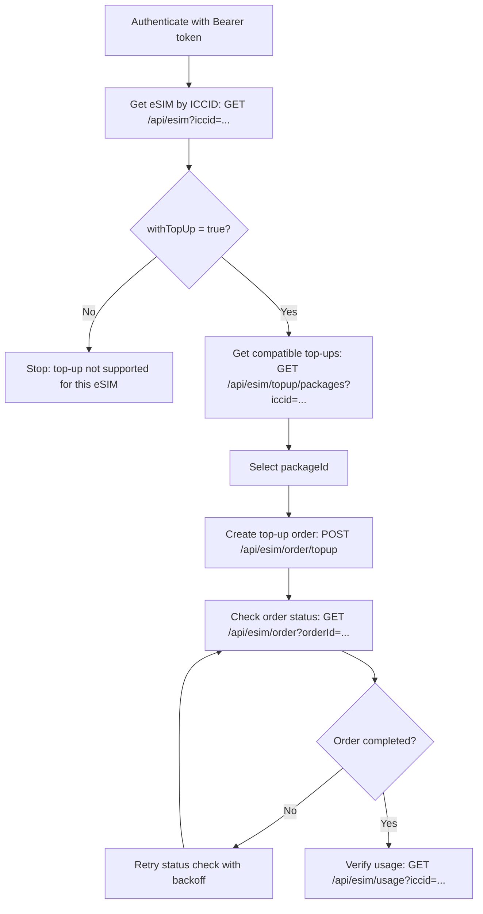

import { Callout } from 'nextra/components';

# eSIM Top-up Flow

This page explains the recommended end-to-end flow for topping up an existing eSIM.

## Table of Contents
- [When to Use This Flow](#when-to-use-this-flow)
- [End-to-End Diagram](#end-to-end-diagram)
- [Step-by-Step Flow](#step-by-step-flow)
- [Error Handling](#error-handling)
- [Related Endpoints](#related-endpoints)

## When to Use This Flow
Use this flow when your customer already has an eSIM and you need to add more data by purchasing a compatible top-up package.

<Callout type="warning" emoji="⚠️">
    Top-up works only for eSIMs that support top-up (`withTopUp = true`).
</Callout>

<Callout type="warning" emoji="⚠️">
    If the eSIM profile is not generated yet, complete `/api/esim/apply` first.
    For packages with `requirements.travelDate = true`, include `startDate` (ISO 8601) in the apply request.
</Callout>

## End-to-End Diagram

## Step-by-Step Flow

### Step 1: Verify eSIM eligibility
Call `GET /api/esim?iccid=...` and confirm:
- eSIM exists and is active for your use case.
- `withTopUp` is `true`.

### Step 2: Find compatible top-up packages
Call `GET /api/esim/topup/packages?iccid=...` to get available top-up options.

Optional filters:
- `days`
- `gbs`
- `isUnlimited`
- `packageId`

### Step 3: Create top-up order
Call `POST /api/esim/order/topup` with:
- `iccid`
- `packageId`
- `referenceId` (optional)

### Step 4: Confirm order status
Use `GET /api/esim/order?orderId=...` to verify the top-up order status.

### Step 5: Confirm updated usage
Call `GET /api/esim/usage?iccid=...` to verify the expected balance/usage update.

## Error Handling
Common status codes in this flow:
- `400`: Invalid request payload or missing required fields.
- `401`: Missing or invalid token.
- `403`: Token is valid but not authorized for this action.
- `500`: Internal server error. Retry with exponential backoff and monitor order status before repeating purchase calls.

## Related Endpoints
- [eSIM API - Manage eSIMs](/esims/esims)
- [eSIM API - Orders](/esims/orders)
- [eSIM API Overview](/esims/overview)
