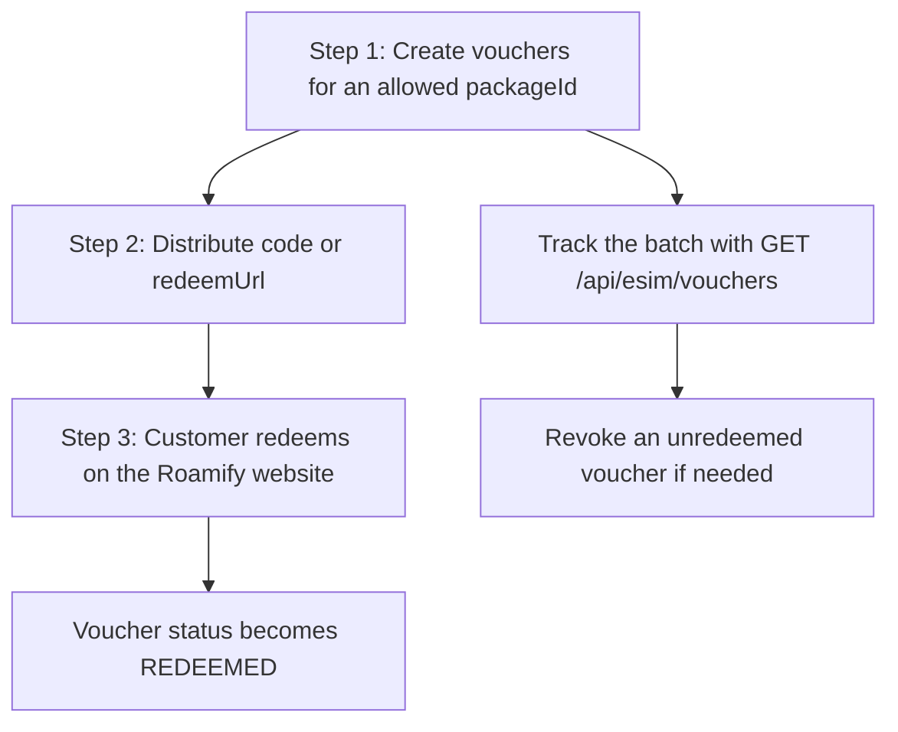

import { Callout, Tabs } from 'nextra/components';

# eSIM API - Vouchers

<Callout type="warning" emoji="⚠️">
    **Selected partners only.** The voucher endpoints are not part of the standard partner surface. They are enabled per API key, together with an allow-list of the exact packages that key may mint vouchers for. If the feature is not enabled on your key, every endpoint on this page returns `403`. Contact [support@getroamify.com](mailto:support@getroamify.com) to have it enabled.
</Callout>

## Table of Contents
- [How Vouchers Work](#how-vouchers-work)
- [Access Requirements](#access-requirements)
- [Create Vouchers](#create-vouchers)
- [Get Vouchers](#get-vouchers)
- [Get Voucher](#get-voucher)
- [Get Voucher by Code](#get-voucher-by-code)
- [Revoke Voucher](#revoke-voucher)
- [The Voucher Object](#the-voucher-object)
- [Voucher Statuses](#voucher-statuses)

## How Vouchers Work
A voucher is a redeemable code that hands one eSIM to whoever holds it. Unlike [Orders](/esims/orders), a voucher is not tied to a traveller at creation time — you mint a batch, distribute the codes however you like (gift cards, campaigns, hotel check-in, support goodwill), and the eSIM is claimed later by the person who redeems it.

Every voucher is backed by a real eSIM bundle that is created up front, so a batch is capped and is not free to mint. The voucher carries a `code` and a `redeemUrl` of the form `https://www.getroamify.com/voucher/{code}`. Give your customer either one — the code alone if they will type it, the URL if you are sending a link.



## Access Requirements
Two separate checks run on every voucher request, both driven by your API key:

| Check | Failure |
| --- | --- |
| The voucher feature is enabled on the API key | `403` - Voucher creation is not enabled for this API key |
| The `packageId` is on the key's allow-list | `403` - This packageId is not allowed for voucher creation with this API key |

The allow-list is an **allowlist**, not a filter: a key with no configured packages can mint nothing. The packages your key is allowed to use are agreed with Roamify when the feature is switched on — the API does not expose the list, so keep it on your side alongside your key.

<Callout type="info" emoji="💡">
    Only [Create Vouchers](#create-vouchers) checks the package allow-list. The read endpoints and [Revoke Voucher](#revoke-voucher) only require the voucher feature to be enabled.
</Callout>

## Create Vouchers
To mint a batch of vouchers, you need to send a `POST` request to the `/api/esim/vouchers` endpoint.

You are required to provide the following parameters in the request body:
- `packageId`: The ID of the eSIM package to mint vouchers for. This is a required field of type `string`. It must be one of the packages your API key is allowed to mint.
- `quantity`: How many vouchers to mint. This is an optional field of type `number`. It must be a whole number between `1` and `10`. The default value is `1`.
- `referenceId`: Your own identifier for this batch. This is an optional field of type `string`. It must not have been used for a previous batch.
- `notes`: A free-text note stored on every voucher in the batch. This is an optional field of type `string`, and may be an empty string.

<Callout type="warning" emoji="⚠️">
    **Always send a `referenceId`.** Creating vouchers is not idempotent on its own — a retried request with no `referenceId` mints a whole second batch. The `referenceId` is what makes a retry safe: a repeat of a batch that already landed is rejected with `409`, and the vouchers that were created can be fetched with [`GET /api/esim/vouchers?referenceId=...`](#get-vouchers).
</Callout>

### Usage - create a batch of vouchers
Here is an example of how you can create vouchers using Roamify eSIM API.

<Tabs items={['curl', 'javascript']}>
    <Tabs.Tab index={0}>
        ```bash
        curl --request POST \
        --url 'https://api-dev.getroamify.com/api/esim/vouchers' \
        --header 'Authorization: Bearer {{token}}' \
        --header 'Content-Type: application/json' \
        --data '{
            "packageId": "esim-global-one-year-365days-0gb-all",
            "quantity": 2,
            "referenceId": "campaign-2026-03",
            "notes": "Spring campaign giveaway"
        }'
        ```
    </Tabs.Tab>
    <Tabs.Tab index={1}>
        ```javascript
        const axios = require('axios');

        axios.post('https://api-dev.getroamify.com/api/esim/vouchers', {
            packageId: 'esim-global-one-year-365days-0gb-all',
            quantity: 2,
            referenceId: 'campaign-2026-03',
            notes: 'Spring campaign giveaway'
        }, {
            headers: {
                'Authorization': 'Bearer {access token here}',
                'Content-Type': 'application/json'
            }
        })
        .then(response => {
            console.log(response.data);
        })
        .catch(error => {
            console.error(error);
        });
        ```
    </Tabs.Tab>
</Tabs>

### Sample Response
A successful request returns `201 Created`.

```json
{
	"status": "success",
	"data": {
		"referenceId": "campaign-2026-03",
		"requestedQuantity": 2,
		"quantity": 2,
		"vouchers": [
			{
				"id": "b06036c5-eadc-4f88-aa31-8c207fec91ec",
				"code": "R7K2M9QX4B1D",
				"redeemUrl": "https://www.getroamify.com/voucher/R7K2M9QX4B1D",
				"status": "ACTIVE",
				"referenceId": "campaign-2026-03",
				"packageId": "esim-global-one-year-365days-0gb-all",
				"package": "1 GB - 365 Days",
				"destination": "Global",
				"price": 9,
				"currency": "USD",
				"esimId": "f72d9b90-52b3-47d9-95f6-2cf61ab176aa",
				"orderId": "67bbabb7-e893-410a-b0a8-4fa62d347b6c",
				"notes": "Spring campaign giveaway",
				"redeemedAt": null,
				"createdAt": 1731837535,
				"updatedAt": 1731837535
			},
			{
				"id": "3f9c1d42-6a77-4a0e-9d19-9d4c1c2f77ab",
				"code": "T4W8ZP2N6C5H",
				"redeemUrl": "https://www.getroamify.com/voucher/T4W8ZP2N6C5H",
				"status": "ACTIVE",
				"referenceId": "campaign-2026-03",
				"packageId": "esim-global-one-year-365days-0gb-all",
				"package": "1 GB - 365 Days",
				"destination": "Global",
				"price": 9,
				"currency": "USD",
				"esimId": "0c1a7b55-9f34-4b62-9a4e-2b7e5d0c9a11",
				"orderId": "a1d2f3c4-5b6e-4f70-8a9b-0c1d2e3f4a5b",
				"notes": "Spring campaign giveaway",
				"redeemedAt": null,
				"createdAt": 1731837535,
				"updatedAt": 1731837535
			}
		]
	}
}
```

### Response fields
- `referenceId`: The reference ID you sent, or an empty string if you did not send one.
- `requestedQuantity`: How many vouchers you asked for.
- `quantity`: How many vouchers were actually created.
- `vouchers`: The vouchers that were created. See [The Voucher Object](#the-voucher-object).

<Callout type="warning" emoji="⚠️">
    A bulk mint spans several eSIM orders, so `quantity` can come back lower than `requestedQuantity` if the batch stopped part-way. Compare the two on every response. Do not retry the same call to make up the difference — the vouchers that did land are already yours, and are retrievable by `referenceId`. Mint the shortfall as a new batch with a new `referenceId`.
</Callout>

### Errors
| HTTP status | Message |
| --- | --- |
| `400` | "packageId" is required |
| `400` | "quantity" must be a number |
| `400` | "quantity" must be greater than or equal to 1 |
| `400` | "quantity" must be less than or equal to 10 |
| `400` | Invalid quantity, please provide a whole number of at least 1 |
| `401` | Unauthorized, please make sure your have provided the correct api key |
| `403` | Voucher creation is not enabled for this API key, please contact support to have it enabled |
| `403` | This packageId is not allowed for voucher creation with this API key, please use one of the packages allowed for your account |
| `409` | Vouchers with the same referenceId already exist, please make sure you have provided a unique referenceId |
| `500` | Failed to create vouchers, please try again later |
| `503` | Vouchers cannot be issued at the moment, please retry shortly or contact support |

## Get Vouchers
To get a list of your vouchers, you need to send a `GET` request to the `/api/esim/vouchers` endpoint.

There are no required parameters for this endpoint, but you can provide the following optional parameters:
- `referenceId`: Return only the vouchers minted under this reference ID. This is an optional field of type `string`.
- `status`: Return only the vouchers in this status. This is an optional field of type `string`. It must be one of `ACTIVE`, `REDEEMED`, or `CANCELLED`, in uppercase. See [Voucher Statuses](#voucher-statuses).
- `packageId`: Return only the vouchers for this package. This is an optional field of type `string`.
- `limit`: The maximum number of vouchers to return. This is an optional field of type `number`, and must be a whole number of at least `1`.

Vouchers are returned newest first, sorted by `createdAt` descending. `limit` is applied after sorting, so it returns the most recent N vouchers. Omitting `limit` returns every matching voucher.

<Callout type="info" emoji="💡">
    This endpoint is not paginated. If you mint large volumes, filter by `referenceId` per batch rather than listing everything.
</Callout>

### Usage - fetch a list of vouchers
<Tabs items={['curl', 'javascript']}>
    <Tabs.Tab index={0}>
        ```bash
        curl --request GET \
        --url 'https://api-dev.getroamify.com/api/esim/vouchers?referenceId=campaign-2026-03&status=ACTIVE&limit=10' \
        --header 'Authorization: Bearer {{token}}' \
        --header 'Content-Type: application/json'
        ```
    </Tabs.Tab>
    <Tabs.Tab index={1}>
        ```javascript
        const axios = require('axios');

        axios.get('https://api-dev.getroamify.com/api/esim/vouchers', {
            params: {
                referenceId: 'campaign-2026-03',
                status: 'ACTIVE',
                limit: 10
            },
            headers: {
                'Authorization': 'Bearer {access token here}',
                'Content-Type': 'application/json'
            }
        })
        .then(response => {
            console.log(response.data);
        })
        .catch(error => {
            console.error(error);
        });
        ```
    </Tabs.Tab>
</Tabs>

### Sample Response
```json
{
	"status": "success",
	"data": {
		"referenceId": "campaign-2026-03",
		"vouchers": [
			{
				"id": "b06036c5-eadc-4f88-aa31-8c207fec91ec",
				"code": "R7K2M9QX4B1D",
				"redeemUrl": "https://www.getroamify.com/voucher/R7K2M9QX4B1D",
				"status": "ACTIVE",
				"referenceId": "campaign-2026-03",
				"packageId": "esim-global-one-year-365days-0gb-all",
				"package": "1 GB - 365 Days",
				"destination": "Global",
				"price": 9,
				"currency": "USD",
				"esimId": "f72d9b90-52b3-47d9-95f6-2cf61ab176aa",
				"orderId": "67bbabb7-e893-410a-b0a8-4fa62d347b6c",
				"notes": "Spring campaign giveaway",
				"redeemedAt": null,
				"createdAt": 1731837535,
				"updatedAt": 1731837535
			}
		]
	}
}
```

`data.referenceId` echoes back the `referenceId` you filtered on, or an empty string if you did not filter by one.

### Errors
| HTTP status | Message |
| --- | --- |
| `400` | "status" must be one of [ACTIVE, REDEEMED, CANCELLED] |
| `400` | "limit" must be greater than or equal to 1 |
| `401` | Unauthorized, please make sure your have provided the correct api key |
| `403` | Voucher creation is not enabled for this API key, please contact support to have it enabled |
| `500` | Failed to get vouchers, please try again later |

## Get Voucher
To get a single voucher by its ID, you need to send a `GET` request to the `/api/esim/voucher/{voucherId}` endpoint.

You are required to provide the following path parameter:
- `voucherId`: The ID of the voucher, as returned in the voucher's `id` field. This is a required field of type `string`.

### Usage - fetch a voucher by ID
<Tabs items={['curl', 'javascript']}>
    <Tabs.Tab index={0}>
        ```bash
        curl --request GET \
        --url 'https://api-dev.getroamify.com/api/esim/voucher/b06036c5-eadc-4f88-aa31-8c207fec91ec' \
        --header 'Authorization: Bearer {{token}}' \
        --header 'Content-Type: application/json'
        ```
    </Tabs.Tab>
    <Tabs.Tab index={1}>
        ```javascript
        const axios = require('axios');

        const voucherId = 'b06036c5-eadc-4f88-aa31-8c207fec91ec';

        axios.get(`https://api-dev.getroamify.com/api/esim/voucher/${voucherId}`, {
            headers: {
                'Authorization': 'Bearer {access token here}',
                'Content-Type': 'application/json'
            }
        })
        .then(response => {
            console.log(response.data);
        })
        .catch(error => {
            console.error(error);
        });
        ```
    </Tabs.Tab>
</Tabs>

### Sample Response
```json
{
	"status": "success",
	"data": {
		"id": "b06036c5-eadc-4f88-aa31-8c207fec91ec",
		"code": "R7K2M9QX4B1D",
		"redeemUrl": "https://www.getroamify.com/voucher/R7K2M9QX4B1D",
		"status": "REDEEMED",
		"referenceId": "campaign-2026-03",
		"packageId": "esim-global-one-year-365days-0gb-all",
		"package": "1 GB - 365 Days",
		"destination": "Global",
		"price": 9,
		"currency": "USD",
		"esimId": "f72d9b90-52b3-47d9-95f6-2cf61ab176aa",
		"orderId": "67bbabb7-e893-410a-b0a8-4fa62d347b6c",
		"notes": "Spring campaign giveaway",
		"redeemedAt": 1731999000,
		"createdAt": 1731837535,
		"updatedAt": 1731999000
	}
}
```

### Errors
| HTTP status | Message |
| --- | --- |
| `401` | Unauthorized, please make sure your have provided the correct api key |
| `403` | Voucher creation is not enabled for this API key, please contact support to have it enabled |
| `404` | Voucher not found, please make sure you have provided the correct voucher ID or code |
| `500` | Failed to get vouchers, please try again later |

<Callout type="info" emoji="💡">
    A voucher belonging to another partner is reported as `404`, not `403`.
</Callout>

## Get Voucher by Code
To look a voucher up by the code you handed out, you need to send a `GET` request to the `/api/esim/voucher/code/{code}` endpoint. This is the endpoint to call when a customer contacts you holding only a code.

You are required to provide the following path parameter:
- `code`: The voucher code. This is a required field of type `string`.

The code is normalised before it is matched: it is trimmed, upper-cased, and every character that is not a letter or digit is stripped. So `r7k2-m9qx-4b1d` and `R7K2M9QX4B1D` both resolve to the same voucher. After normalisation the code must be exactly **12 alphanumeric characters** — anything else is reported as `404`.

### Usage - fetch a voucher by code
<Tabs items={['curl', 'javascript']}>
    <Tabs.Tab index={0}>
        ```bash
        curl --request GET \
        --url 'https://api-dev.getroamify.com/api/esim/voucher/code/R7K2M9QX4B1D' \
        --header 'Authorization: Bearer {{token}}' \
        --header 'Content-Type: application/json'
        ```
    </Tabs.Tab>
    <Tabs.Tab index={1}>
        ```javascript
        const axios = require('axios');

        const code = 'R7K2M9QX4B1D';

        axios.get(`https://api-dev.getroamify.com/api/esim/voucher/code/${code}`, {
            headers: {
                'Authorization': 'Bearer {access token here}',
                'Content-Type': 'application/json'
            }
        })
        .then(response => {
            console.log(response.data);
        })
        .catch(error => {
            console.error(error);
        });
        ```
    </Tabs.Tab>
</Tabs>

### Sample Response
```json
{
	"status": "success",
	"data": {
		"id": "b06036c5-eadc-4f88-aa31-8c207fec91ec",
		"code": "R7K2M9QX4B1D",
		"redeemUrl": "https://www.getroamify.com/voucher/R7K2M9QX4B1D",
		"status": "ACTIVE",
		"referenceId": "campaign-2026-03",
		"packageId": "esim-global-one-year-365days-0gb-all",
		"package": "1 GB - 365 Days",
		"destination": "Global",
		"price": 9,
		"currency": "USD",
		"esimId": "f72d9b90-52b3-47d9-95f6-2cf61ab176aa",
		"orderId": "67bbabb7-e893-410a-b0a8-4fa62d347b6c",
		"notes": "Spring campaign giveaway",
		"redeemedAt": null,
		"createdAt": 1731837535,
		"updatedAt": 1731837535
	}
}
```

### Errors
| HTTP status | Message |
| --- | --- |
| `401` | Unauthorized, please make sure your have provided the correct api key |
| `403` | Voucher creation is not enabled for this API key, please contact support to have it enabled |
| `404` | Voucher not found, please make sure you have provided the correct voucher ID or code |
| `500` | Failed to get vouchers, please try again later |

## Revoke Voucher
To cancel a voucher and the eSIM behind it, you need to send a `PUT` request to the `/api/esim/voucher/{voucherId}/revoke` endpoint. Use it for a code that was distributed by mistake, leaked, or is no longer wanted.

You are required to provide the following path parameter:
- `voucherId`: The ID of the voucher to revoke. This is a required field of type `string`.

No request body is required.

<Callout type="warning" emoji="⚠️">
    Revoking is permanent and cancels the underlying eSIM as well as the code. Only `ACTIVE` vouchers can be revoked — a voucher a customer has already redeemed cannot be taken back, and returns `409`.
</Callout>

### Usage - revoke a voucher
<Tabs items={['curl', 'javascript']}>
    <Tabs.Tab index={0}>
        ```bash
        curl --request PUT \
        --url 'https://api-dev.getroamify.com/api/esim/voucher/b06036c5-eadc-4f88-aa31-8c207fec91ec/revoke' \
        --header 'Authorization: Bearer {{token}}' \
        --header 'Content-Type: application/json'
        ```
    </Tabs.Tab>
    <Tabs.Tab index={1}>
        ```javascript
        const axios = require('axios');

        const voucherId = 'b06036c5-eadc-4f88-aa31-8c207fec91ec';

        axios.put(`https://api-dev.getroamify.com/api/esim/voucher/${voucherId}/revoke`, {}, {
            headers: {
                'Authorization': 'Bearer {access token here}',
                'Content-Type': 'application/json'
            }
        })
        .then(response => {
            console.log(response.data);
        })
        .catch(error => {
            console.error(error);
        });
        ```
    </Tabs.Tab>
</Tabs>

### Sample Response
```json
{
	"status": "success",
	"data": {
		"id": "b06036c5-eadc-4f88-aa31-8c207fec91ec",
		"status": "CANCELLED"
	}
}
```

### Errors
| HTTP status | Message |
| --- | --- |
| `401` | Unauthorized, please make sure your have provided the correct api key |
| `403` | Voucher creation is not enabled for this API key, please contact support to have it enabled |
| `404` | Voucher not found, please make sure you have provided the correct voucher ID or code |
| `409` | Voucher has already been redeemed and can no longer be revoked |
| `409` | Only active vouchers can be revoked, this voucher is no longer active |
| `500` | Failed to revoke voucher, please try again later |

## The Voucher Object
Every voucher endpoint returns the same voucher shape.

| Field | Type | Description |
| --- | --- | --- |
| `id` | `string` | The ID of the voucher. Use it with [Get Voucher](#get-voucher) and [Revoke Voucher](#revoke-voucher). |
| `code` | `string` | The 12-character redemption code. This is what you hand to your customer. |
| `redeemUrl` | `string` | The redemption link, `https://www.getroamify.com/voucher/{code}`. |
| `status` | `string` | The voucher's status. See [Voucher Statuses](#voucher-statuses). |
| `referenceId` | `string` | The reference ID of the batch this voucher was minted in, or an empty string. |
| `packageId` | `string` | The ID of the eSIM package the voucher is worth. |
| `package` | `string` | The display name of the package, for example `1 GB - 365 Days`. |
| `destination` | `string` | The country or region the package covers. |
| `price` | `number` | The price of the package. |
| `currency` | `string` | The currency of `price`. Always `USD`. |
| `esimId` | `string` | The ID of the eSIM backing this voucher. |
| `orderId` | `string` | The ID of the order the eSIM was created under. |
| `notes` | `string` | The note you stored on the batch, or an empty string. |
| `redeemedAt` | `number \| null` | The Unix timestamp of redemption, or `null` if the voucher has not been redeemed. |
| `createdAt` | `number` | The Unix timestamp of when the voucher was created. |
| `updatedAt` | `number` | The Unix timestamp of when the voucher was last updated. |

## Voucher Statuses
A voucher's `status` can be any of the following values:

| Status | Meaning |
| --- | --- |
| `ACTIVE` | Minted and not yet claimed. The code can be redeemed, and the voucher can be revoked. |
| `REDEEMED` | A customer has claimed the voucher. `redeemedAt` is set, and the voucher can no longer be revoked. |
| `CANCELLED` | The voucher was revoked. The code and the eSIM behind it are dead. |
