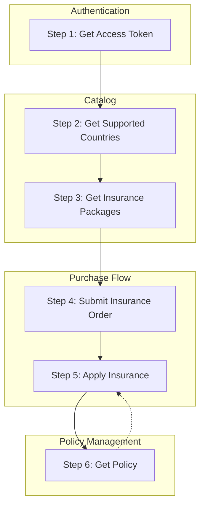

import { Callout, Tabs } from 'nextra/components';

# Insurance API Overview

<Callout type="warning" emoji="⚠️">
    **Eligibility: Saudi Arabia citizens and residents only.** Insurance packages may only be sold to travellers who are citizens or residents of Saudi Arabia. Roamify's request validation is deliberately looser than the provider's, so an ineligible traveller can pass validation on `POST /api/insurance/apply` and still be rejected at issuance.
</Callout>

## Table of Contents
- [Roamify Insurance Overview](#roamify-insurance-overview)
- [How insurance differs from eSIMs](#how-insurance-differs-from-esims)
- [Recommended steps to use Insurance API](#recommended-steps-to-use-insurance-api)

## Roamify Insurance Overview
Roamify Insurance API consists of the following services:

- [Countries](/insurance/countries)
- [Packages](/insurance/packages)
- [Orders](/insurance/orders)
- [Policies](/insurance/policies)

You use these services to browse insurance products, reserve policies through an order, and issue each policy against a named traveller.

## How insurance differs from eSIMs
If you have already integrated the eSIM API, three differences matter:

1. **Ordering and issuance are separate.** `POST /api/insurance/order` reserves one policy per unit of quantity and returns a `policyId` for each. The policy is not issued until you call `POST /api/insurance/apply` with the traveller's details.
2. **Traveller details are required at issuance.** Each package declares a `requirements` object that tells you which traveller fields you must collect. See [Policies](/insurance/policies).
3. **The catalogs do not mix.** Every insurance `packageId` starts with `insurance-`. Insurance packages cannot be ordered through `POST /api/esim/order`, and eSIM packages cannot be ordered through `POST /api/insurance/order`.

## Recommended steps to use Insurance API

Before implementing each step, review the endpoint-specific reference page for request and response schema details:
- [Countries](/insurance/countries)
- [Packages](/insurance/packages)
- [Orders](/insurance/orders)
- [Policies](/insurance/policies)

### Step 0: Flow Diagram


### Step 1: Authentication
You need your Access Token to make requests to Roamify Insurance API. You can get your Access Token from the [Roamify Partner Portal](https://partner.getroamify.com/sign-in).

If you don't have an account, you can sign up [here](https://partner.getroamify.com/sign-up) or contact us at [support@getroamify.com](mailto:support@getroamify.com).

Our token is a Bearer token, which means you need to include it in the `Authorization` header of your requests.

### Step 2: Get Supported Countries
To get the countries the insurance catalog covers, send a `GET` request to the `/api/insurance/countries` endpoint.

<Tabs items={['curl', 'javascript']}>
    <Tabs.Tab index={0}>
        ```bash
        curl --request GET \
        --url 'https://api-dev.getroamify.com/api/insurance/countries' \
        --header 'Authorization: Bearer {{token}}' \
        --header 'Content-Type: application/json'
        ```
    </Tabs.Tab>
    <Tabs.Tab index={1}>
        ```javascript
        const axios = require('axios');

        axios.get('https://api-dev.getroamify.com/api/insurance/countries', {
            headers: {
                'Authorization': 'Bearer {access token here}',
                'Content-Type': 'application/json'
            }
        })
        .then(response => {
            console.log(response.data);
        })
        .catch(error => {
            console.error(error);
        });
        ```
    </Tabs.Tab>
</Tabs>

You can read more about this endpoint [here](/insurance/countries).

### Step 3: Get Insurance Packages
To get a list of insurance packages, send a `GET` request to the `/api/insurance/packages` endpoint.

Before filtering by country, fetch `GET /api/insurance/countries` and use only these values:
- `country`: use the returned `name`
- `countryCode`: use the returned `code`

You can also filter by `geography`, `day`, and `packageId`.

<Tabs items={['curl', 'javascript']}>
    <Tabs.Tab index={0}>
        ```bash
        curl --request GET \
        --url 'https://api-dev.getroamify.com/api/insurance/packages?countryCode=SA' \
        --header 'Authorization: Bearer {{token}}' \
        --header 'Content-Type: application/json'
        ```
    </Tabs.Tab>
    <Tabs.Tab index={1}>
        ```javascript
        const axios = require('axios');

        axios.get('https://api-dev.getroamify.com/api/insurance/packages?countryCode=SA', {
            headers: {
                'Authorization': 'Bearer {access token here}',
                'Content-Type': 'application/json'
            }
        })
        .then(response => {
            console.log(response.data);
        })
        .catch(error => {
            console.error(error);
        });
        ```
    </Tabs.Tab>
</Tabs>

<Callout type="info" emoji="💡">
    Read the `requirements` object on the package you intend to sell. It tells you which traveller fields you must collect before you can issue the policy in Step 5.
</Callout>

You can read more about this endpoint [here](/insurance/packages).

### Step 4: Submit an Insurance Order
To reserve policies, send a `POST` request to the `/api/insurance/order` endpoint.

The request body should contain the following parameters:
- `items`: An array of insurance packages you want to order. Each item should contain the following details:
  - `packageId`: The ID of the insurance package. This is a required field of type `string`.
  - `quantity`: The number of policies you want to reserve for this package. This is a required field of type `number`.
- `referenceId`: Your own reference for the order. This is an optional field of type `string`.

<Tabs items={['curl', 'javascript']}>
    <Tabs.Tab index={0}>
        ```bash
        curl --request POST \
        --url 'https://api-dev.getroamify.com/api/insurance/order' \
        --header 'Authorization: Bearer {{token}}' \
        --header 'Content-Type: application/json' \
        --data '{
            "items": [
                {
                    "packageId": "Package ID",
                    "quantity": 1
                }
            ]
        }'
        ```
    </Tabs.Tab>
    <Tabs.Tab index={1}>
        ```javascript
        const axios = require('axios');

        axios.post('https://api-dev.getroamify.com/api/insurance/order', {
            items: [
                {
                    packageId: 'Package ID',
                    quantity: 1
                }
            ]
        }, {
            headers: {
                'Authorization': 'Bearer {access token here}',
                'Content-Type': 'application/json'
            }
        })
        .then(response => {
            console.log(response.data);
        })
        .catch(error => {
            console.error(error);
        });
        ```
    </Tabs.Tab>
</Tabs>

The response contains one item per reserved policy, each with its own `policyId`. A `quantity` of `2` returns two items with two distinct `policyId` values.

You can read more about this endpoint [here](/insurance/orders).

### Step 5: Apply Insurance
A reserved policy carries no traveller. To issue it, send a `POST` request to the `/api/insurance/apply` endpoint with the `policyId` from Step 4 and the traveller's details.

The request body should contain the following parameters:
- `policyId`: The ID of the reserved policy. This is a required field of type `string`.
- `startDate`: Coverage start date in `DD/MM/YYYY` format. This is a required field of type `string`.
- `endDate`: Coverage end date in `DD/MM/YYYY` format. This is a required field of type `string`.
- `mobile`: The traveller's mobile number, 8 to 15 digits, in international format without the leading `+`. This is a required field of type `string`.
- `email`: The traveller's email address. This is a required field of type `string`.
- `insurer`: The primary insured traveller. This is a required field of type `object`.

<Callout type="warning" emoji="⚠️">
    Coverage cannot start today. `startDate` must be at least 1 day in the future, and `endDate` must be after `startDate`.
</Callout>

<Tabs items={['curl', 'javascript']}>
    <Tabs.Tab index={0}>
        ```bash
        curl --request POST \
        --url 'https://api-dev.getroamify.com/api/insurance/apply' \
        --header 'Authorization: Bearer {{token}}' \
        --header 'Content-Type: application/json' \
        --data '{
            "policyId": "Policy ID",
            "startDate": "01/08/2026",
            "endDate": "08/08/2026",
            "mobile": "966512345678",
            "email": "traveller@example.com",
            "insurer": {
                "firstName": "Fahad",
                "lastName": "Al Otaibi",
                "nationality": "Saudi Arabia",
                "dateOfBirth": "24/06/1990",
                "idNumber": "1012345678"
            }
        }'
        ```
    </Tabs.Tab>
    <Tabs.Tab index={1}>
        ```javascript
        const axios = require('axios');

        axios.post('https://api-dev.getroamify.com/api/insurance/apply', {
            policyId: 'Policy ID',
            startDate: '01/08/2026',
            endDate: '08/08/2026',
            mobile: '966512345678',
            email: 'traveller@example.com',
            insurer: {
                firstName: 'Fahad',
                lastName: 'Al Otaibi',
                nationality: 'Saudi Arabia',
                dateOfBirth: '24/06/1990',
                idNumber: '1012345678'
            }
        }, {
            headers: {
                'Authorization': 'Bearer {access token here}',
                'Content-Type': 'application/json'
            }
        })
        .then(response => {
            console.log(response.data);
        })
        .catch(error => {
            console.error(error);
        });
        ```
    </Tabs.Tab>
</Tabs>

On success, the response contains the issued `policy` object with the provider's `policyNo` and a `policyLink` you can pass to your customer.

You can read more about this endpoint [here](/insurance/policies).

### Step 6: Get Policy
To read the current state of a policy, send a `GET` request to the `/api/insurance/policy` endpoint with the `policyId`.

<Callout type="info" emoji="💡">
    If `POST /api/insurance/apply` returns `409` with the message about the policy currently being issued, do not retry the apply call. Poll `GET /api/insurance/policy?policyId=Policy ID` until `status` becomes `ISSUED`.
</Callout>

<Tabs items={['curl', 'javascript']}>
    <Tabs.Tab index={0}>
        ```bash
        curl --request GET \
        --url 'https://api-dev.getroamify.com/api/insurance/policy?policyId=Policy ID' \
        --header 'Authorization: Bearer {{token}}' \
        --header 'Content-Type: application/json'
        ```
    </Tabs.Tab>
    <Tabs.Tab index={1}>
        ```javascript
        const axios = require('axios');

        axios.get('https://api-dev.getroamify.com/api/insurance/policy?policyId=Policy ID', {
            headers: {
                'Authorization': 'Bearer {access token here}',
                'Content-Type': 'application/json'
            }
        })
        .then(response => {
            console.log(response.data);
        })
        .catch(error => {
            console.error(error);
        });
        ```
    </Tabs.Tab>
</Tabs>

You can read more about this endpoint [here](/insurance/policies).

### The End
That's it! You have successfully integrated Roamify Insurance API into your application. If you have any questions or need help, feel free to contact us at [support@getroamify.com](mailto:support@getroamify.com).
