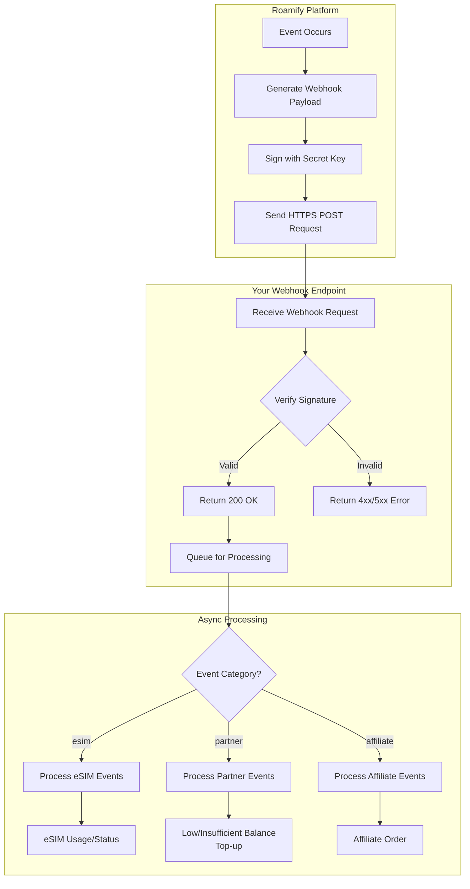

import {Tabs} from "nextra/components";

# Roamify Webhooks Overview
Roamify Webhooks provides a way for API users to receive notifications about various events within the platform.

Currently, it supports the following features:
- **eSIM Usage**: Receive notifications about eSIM data usage at configurable intervals
- **eSIM Status**: Receive notifications when an eSIM's status changes (activated, deactivated, suspended, etc.)
- **Partner Balance**: Receive notifications about changes in your partner account balance
- **Affiliate Orders**: Receive notifications when orders are placed through your affiliate links
- **More Features**: We are constantly working on adding more features to Roamify Webhooks.

## Table of Contents
- [Mandatory Requirements](#mandatory-requirements)
- [Recommended Practices](#recommended-practices)
    - [Sample Verification Code](#sample-verification-code)

## Mandatory Requirements
To use Roamify Webhooks, you must meet the following requirements:
- **HTTPS Endpoint**: Your webhook endpoint must be accessible over HTTPS.
- **Valid SSL Certificate**: The endpoint must have a valid SSL certificate to ensure secure communication.
- **Signature Verification**: Each webhook request will include a signature in the `X-Roamify-Signature` header. You must verify this signature using your secret key to ensure that the request is legitimate and has not been tampered with.
- **Response Handling**: Your endpoint must respond with a 200 OK status code quickly (within 3 seconds) to acknowledge receipt of the webhook prior to any complex processing that may take longer.

## Recommended Practices
Here is a high level overview of the recommended practices for using Roamify Webhooks:
- **Use a Queue**: If your webhook processing involves complex logic or external API calls,
    consider using a message queue to handle the webhook processing asynchronously. This allows you to respond quickly to the webhook request while processing the data in the background.
- **Logging**: Log all incoming webhook requests and their responses to help with debugging and monitoring.
- **Error Handling**: Implement error handling to gracefully handle any issues that may arise during webhook processing. This includes logging errors and sending notifications if necessary.
- **Testing**: Test your webhook endpoint thoroughly to ensure that it can handle various scenarios, including valid and invalid requests, network issues, and other edge cases.
- **Security**: Keep your webhook endpoint secure by implementing authentication and authorization mechanisms. This can include IP whitelisting, API keys, or other security measures to ensure that only authorized requests are processed.

### Sample Webhook Flow

Below is a code snippet that demonstrates how to verify the signature of a webhook request in JavaScript:
 <Tabs items={['javascript', 'php', 'python']}>
        <Tabs.Tab index={0}>
            ```javascript
            const crypto = require('crypto');
            const secret = 'your_secret' // Replace with your actual secret key
            const rawBody = req.rawBody; // The raw body of the request
            const signature = req.headers['x-roamify-signature']; // The signature from the request

            const computedSignature = crypto
            .createHmac('sha256', secret)
            .update(rawBody, 'utf8')
            .digest('hex');

            if (computedSignature !== signature) {
                throw new Error('Invalid signature');
            }

            // process the webhook data here
            if(event_category === 'esim') {
                if(event_type === 'esim_usage') {
                    // handle esim usage event
                } else if(event_type === 'esim_status') {
                    // handle esim status event
                }
            } else if(event_category === 'partner') {
                if(event_type === 'low_balance') {
                    // handle partner balance event
                } else if(event_type === 'insufficient_balance') {
                    // handle insufficient balance event
                } else if(event_type === 'top_up') {
                    // handle top up event
                }
            } else if(event_category === 'affiliate') {
                if(event_type === 'order') {
                    // handle affiliate order event
                } else {
                    throw new Error('Unknown event type for affiliate');
                }
            } else {
                throw new Error('Unknown event category');
            }

            return res.status(200).send({
                code: 200,
                message: 'success'
            });
        });
            ```
        </Tabs.Tab>
        <Tabs.Tab index={1}>
            ```php
            $secret = 'your_secret'; // Replace with your actual secret key
            $rawBody = file_get_contents('php://input'); // The raw body of the request
            $signature = $_SERVER['HTTP_X_ROAMIFY_SIGNATURE']; // The signature from the request

            $computedSignature = hash_hmac('sha256', $rawBody, $secret);

            if ($computedSignature !== $signature) {
            throw new Exception('Invalid signature');
            }

            // process the webhook data here
            if($event_category === 'esim') {
                if($event_type === 'esim_usage') {
                    // handle esim usage event
                } else if($event_type === 'esim_status') {
                    // handle esim status event
                }
            } else if($event_category === 'partner') {
                if($event_type === 'low_balance') {
                    // handle partner balance event
                } else if($event_type === 'insufficient_balance') {
                    // handle insufficient balance event
                } else if($event_type === 'top_up') {
                    // handle top up event
                }
            } else if($event_category === 'affiliate') {
                if($event_type === 'order') {
                    // handle affiliate order event
                } else {
                    throw new Exception('Unknown event type for affiliate');
                }
            } else {
                throw new Exception('Unknown event category');
            }

            return response()->json([
                'code' => 200,
                'message' => 'success'
            ]);
            ```
        </Tabs.Tab>
    <Tabs.Tab index={2}>
        ```python
        import hmac
        import hashlib
        import base64
        from flask import request

        secret = 'your_secret'  # Replace with your actual secret key
        raw_body = request.get_data(as_text=True)  # The raw body of the request
        signature = request.headers.get('X-Roamify-Signature')  # The signature from the request

        computed_signature = hmac.new(
            secret.encode('utf-8'),
            raw_body.encode('utf-8'),
            hashlib.sha256
        ).hexdigest()

        if computed_signature != signature:
            raise Exception('Invalid signature')

        # process the webhook data here
        if event_category == 'esim':
            if event_type == 'esim_usage':
                # handle esim usage event
            elif event_type == 'esim_status':
                # handle esim status event
        elif event_category == 'partner':
            if event_type == 'low_balance':
                # handle partner balance event
            elif event_type == 'insufficient_balance':
                # handle insufficient balance event
            elif event_type == 'top_up':
                # handle top up event
        elif event_category == 'affiliate':
            if event_type == 'order':
                # handle affiliate order event
            else:
                raise Exception('Unknown event type for affiliate')
        else:
            raise Exception('Unknown event category')

        return {
            'code': 200,
            'message': 'success'
        }
        ```
        </Tabs.Tab>
    </Tabs>

### Architecture Diagram
