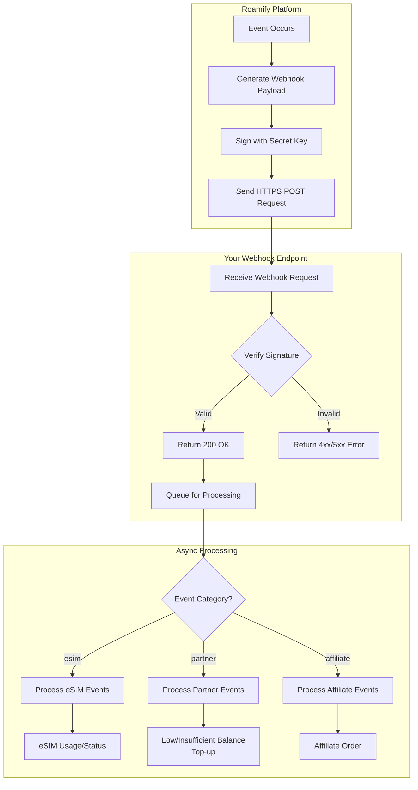

import { Tabs } from 'nextra/components';

# Roamify Webhooks Overview
Roamify Webhooks lets API users receive event notifications from the Roamify platform.

Currently, it supports the following features:
- **eSIM Usage**: Receive notifications about eSIM data usage at configurable intervals
- **eSIM Status**: Receive notifications when an eSIM's status changes (activated, deactivated, suspended, etc.)
- **Partner Balance**: Receive notifications about changes in your partner account balance
- **Affiliate Orders**: Receive notifications when orders are placed through your affiliate links
- **More Features**: We are constantly working on adding more features to Roamify Webhooks.

## Table of Contents
- [Mandatory Requirements](#mandatory-requirements)
- [Recommended Practices](#recommended-practices)
- [Sample Webhook Flow](#sample-webhook-flow)
- [Architecture Diagram](#architecture-diagram)

## Mandatory Requirements
To use Roamify Webhooks, you must meet the following requirements:
- **HTTPS Endpoint**: Your webhook endpoint must be accessible over HTTPS.
- **Valid SSL Certificate**: The endpoint must have a valid SSL certificate to ensure secure communication.
- **Signature Verification**: Each webhook request will include a signature in the `X-Roamify-Signature` header. You must verify this signature using your secret key to ensure that the request is legitimate and has not been tampered with.
- **Response Handling**: Your endpoint must respond with a 200 OK status code quickly (within 3 seconds) to acknowledge receipt of the webhook prior to any complex processing that may take longer.

## Recommended Practices
Here is a high level overview of the recommended practices for using Roamify Webhooks:
- **Use a Queue**: If your webhook processing involves complex logic or external API calls,
    consider using a message queue to handle the webhook processing asynchronously. This allows you to respond quickly to the webhook request while processing the data in the background.
- **Logging**: Log all incoming webhook requests and their responses to help with debugging and monitoring.
- **Error Handling**: Implement error handling to gracefully handle any issues that may arise during webhook processing. This includes logging errors and sending notifications if necessary.
- **Testing**: Test your webhook endpoint thoroughly to ensure that it can handle various scenarios, including valid and invalid requests, network issues, and other edge cases.
- **Security**: Keep your webhook endpoint secure by implementing authentication and authorization mechanisms. This can include IP whitelisting, API keys, or other security measures to ensure that only authorized requests are processed.

### Sample Webhook Flow

Below are minimal examples that verify the webhook signature and acknowledge the request quickly.

<Tabs items={['javascript', 'php', 'python']}>
    <Tabs.Tab index={0}>
        ```javascript
        const crypto = require('crypto');

        function verifySignature(rawBody, signature, secret) {
          const computed = crypto.createHmac('sha256', secret).update(rawBody, 'utf8').digest('hex');
          return signature.length === computed.length && crypto.timingSafeEqual(Buffer.from(computed), Buffer.from(signature));
        }

        // Example Express handler
        app.post('/webhooks/roamify', (req, res) => {
          const secret = process.env.ROAMIFY_WEBHOOK_SECRET;
          const signature = req.header('x-roamify-signature') || '';
          const rawBody = req.rawBody || JSON.stringify(req.body);

          if (!verifySignature(rawBody, signature, secret)) {
            return res.status(401).json({ code: 401, message: 'invalid signature' });
          }

          const { event_category, event_type } = req.body;

          // Queue your async processing here
          // queueWebhook({ event_category, event_type, payload: req.body });

          return res.status(200).json({ code: 200, message: 'success' });
        });
        ```
    </Tabs.Tab>
    <Tabs.Tab index={1}>
        ```php
        <?php
        $secret = getenv('ROAMIFY_WEBHOOK_SECRET');
        $rawBody = file_get_contents('php://input');
        $signature = $_SERVER['HTTP_X_ROAMIFY_SIGNATURE'] ?? '';

        $computed = hash_hmac('sha256', $rawBody, $secret);

        if (!hash_equals($computed, $signature)) {
            http_response_code(401);
            echo json_encode(['code' => 401, 'message' => 'invalid signature']);
            exit;
        }

        $payload = json_decode($rawBody, true);
        $eventCategory = $payload['event_category'] ?? null;
        $eventType = $payload['event_type'] ?? null;

        // Queue your async processing here

        http_response_code(200);
        echo json_encode(['code' => 200, 'message' => 'success']);
        ```
    </Tabs.Tab>
    <Tabs.Tab index={2}>
        ```python
        import hashlib
        import hmac
        import os
        from flask import request, jsonify

        def verify_signature(raw_body: str, signature: str, secret: str) -> bool:
            computed = hmac.new(secret.encode('utf-8'), raw_body.encode('utf-8'), hashlib.sha256).hexdigest()
            return hmac.compare_digest(computed, signature)

        def roamify_webhook_handler():
            secret = os.environ['ROAMIFY_WEBHOOK_SECRET']
            raw_body = request.get_data(as_text=True)
            signature = request.headers.get('X-Roamify-Signature', '')

            if not verify_signature(raw_body, signature, secret):
                return jsonify({'code': 401, 'message': 'invalid signature'}), 401

            payload = request.get_json(silent=True) or {}
            event_category = payload.get('event_category')
            event_type = payload.get('event_type')

            # Queue your async processing here

            return jsonify({'code': 200, 'message': 'success'}), 200
        ```
    </Tabs.Tab>
</Tabs>

### Architecture Diagram

```mermaid
graph TD;
    subgraph Roamify [Roamify Platform]
        A[Event Occurs]
        B[Generate Webhook Payload]
        C[Sign with Secret Key]
        D[Send HTTPS POST Request]
    end
    subgraph YourEndpoint [Your Webhook Endpoint]
        E[Receive Webhook Request]
        F{Verify Signature}
        G[Return 200 OK]
        H[Return 4xx/5xx Error]
        I[Queue for Processing]
    end
    subgraph Processing [Async Processing]
        J{Event Category?}
        K[Process eSIM Events]
        L[Process Partner Events]
        M[Process Affiliate Events]
        N[eSIM Usage/Status]
        O[Low/Insufficient Balance<br/>Top-up]
        P[Affiliate Order]
    end
    A --> B;
    B --> C;
    C --> D;
    D --> E;
    E --> F;
    F -->|Valid| G;
    F -->|Invalid| H;
    G --> I;
    I --> J;
    J -->|esim| K;
    J -->|partner| L;
    J -->|affiliate| M;
    K --> N;
    L --> O;
    M --> P;
```